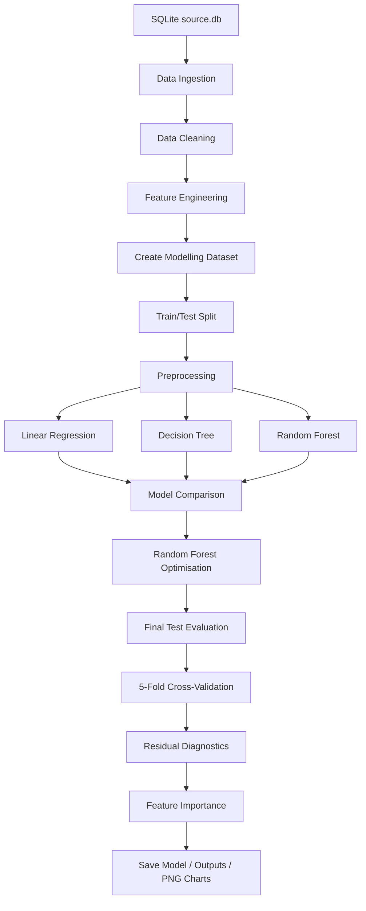

### DAB Challenge 1: O-Level Mathematics Performance Analysis
---

<details open>
<summary><b>🔭 PROJECT OVERVIEW</b></summary></br>

This submission implements a reusable Python-based end-to-end machine learning pipeline for predicting students' O-Level Mathematics examination score (`final_test`).

This analysis aims to answer the following problem statement:

> **How can student academic habits, attendance and lifestyle characteristics be used to predict O-Level mathematics performance and identify students who may benefit from early academic support?**

The intended users of the model output are the **School Academic Support Team / Student Welfare Team**. The predicted score and illustrative support flag are designed as **decision-support signals**, not automated decisions about students.

📒Task 1: EDA and analytical reasoning are retained in the Jupyter notebook. 
📘Task 2: Operationalises the selected cleaning rules, feature engineering, preprocessing, model experimentation, optimisation and evaluation as `.py` scripts.

</details>

---

<details open>
<summary><b>🗂️ FOLDER STRUCTURE</b></summary></br>

```text
submission/
├── data/
│   └── source.db
│
├── src/
│   ├── __init__.py
│   ├── config.py
│   ├── data_ingestion.py
│   ├── data_preprocessing.py
│   ├── feature_engineering.py
│   ├── preprocessing.py
│   ├── model_experiment.py
│   ├── model_evaluation.py
│   ├── visualization.py
│   ├── reporting.py
│   ├── run_pipeline.py
│   ├── predict.py
│   └── pipeline.py
│
├── outputs/
│   └── generated CSV / JSON outputs
│
├── models/
│   └── tuned_random_forest_pipeline.joblib
│
├── charts/
│   └── generated PNG charts
│
├── run_pipeline.py
├── predict.py
├── example_new_students.csv
├── requirements.txt
└── README.md
```
</details>

---

<details open>
<summary><b>💻 MAIN MODULES</b></summary></br>

| Module | Purpose |
|---|---|
| `config.py` | Central configuration for paths, features, random seed, imputation, tuning and model parameters |
| `data_ingestion.py` | Imports the provided dataset directly from SQLite |
| `data_preprocessing.py` | Applies categorical standardisation, age treatment and duplicate-record consolidation |
| `feature_engineering.py` | Creates `sleep_duration`, `class_size` and `female_ratio` |
| `preprocessing.py` | Creates the sklearn numerical and categorical preprocessing transformer |
| `model_experiment.py` | Trains 3 baseline models and runs Random Forest hyperparameter optimisation |
| `model_evaluation.py` | Calculates MAE, RMSE, R², cross-validation, diagnostics and feature importance |
| `visualization.py` | Saves model comparison, diagnostic and interpretation charts as PNG |
| `reporting.py` | Saves tabular/JSON record-keeping outputs |
| `pipeline.py` | Orchestrates the complete machine-learning workflow |
| `run_pipeline.py` | Command-line entry point for training and evaluation |
| `predict.py` | Reuses the saved fitted pipeline on new student records |

</details>

---

<details open>
<summary><b>🔄 PIPELINE DESIGN AND LOGICAL FLOW</b></summary></br>


</details>

---

<details open>
<summary><b>🔄 PIPELINE SEQUENCE</b></summary></br>

1. Import data directly from the provided SQLite database.
2. Standardise identified categorical inconsistencies.
3. Treat invalid age values.
4. Consolidate duplicate student records and recover complementary non-null values.
5. Engineer `sleep_duration` and `class_size`.
6. Remove records with missing `final_test` because supervised training requires a known target.
7. Select the final predictors identified during Task 1.
8. Split the modelling data into training and test data using `random_state=27`.
9. Median-impute missing numerical predictor values and one-hot encode categorical predictors.
10. Experiment with Linear Regression, Decision Tree Regression and Random Forest Regression.
11. Optimise Random Forest using `RandomizedSearchCV`.
12. Evaluate the selected model using MAE, RMSE, R² and cross-validation.
13. Run residual diagnostics and aggregate Random Forest feature importance.
14. Save the fitted model, CSV/JSON outputs and PNG charts.

</details>

---

<details open>
<summary><b>🏃🏻‍♂️ HOW TO EXECUTE THE PIPELINE?</b></summary></br>


##### STEP 1. Copy the database file to the data folder

Copy the challenge database to:

```text
data/source.db
```

If your downloaded database has a different filename, either rename it to `source.db` or pass its path using `--db`.

##### STEP 2. Create and activate a virtual environment

macOS / Linux:

```bash
python3 -m venv .venv
source .venv/bin/activate
```

Windows:

```bash
python -m venv .venv
.venv\Scripts\activate
```

##### STEP 3. Install dependencies

```bash
pip install -r requirements.txt
```

##### STEP 4. Run the full pipeline

```bash
python -m src.run_pipeline
```

By default the pipeline runs the Random Forest hyperparameter search.

##### For a faster ML reproduction execution

To use the already validated winning parameters from Task 1 instead of repeating the search:

```bash
python -m src.run_pipeline --skip-tuning
```

</details>

---

<details open>
<summary><b>💻 CONFIGURABILITY</b></summary></br>

The pipeline is configurable through both `src/config.py` and command-line arguments.

##### Examples

1. To use another database:

```bash
python -m src.run_pipeline --db data/my_database.db
```

2. Specify a SQLite table when multiple tables exist:

```bash
python -m src.run_pipeline --table student_scores
```

3. Change train/test split:

```bash
python -m src.run_pipeline --test-size 0.18
```

4. Change random seed:

```bash
python -m src.run_pipeline --random-state 27
```

5. Experiment with mean rather than median numerical imputation:

```bash
python -m src.run_pipeline --numeric-imputer mean
```

6. Change the illustrative support threshold:

```bash
python -m src.run_pipeline --support-threshold 55
```

Important model settings can also be modified centrally in `src/config.py`.

</details>

---

<details open>
<summary><b>🔎 EDA FINDINGS AND PIPELINE CHOICES</b></summary></br> 

A Exploratory Data Analysis (EDA) was performed to investigate data quality, engineer candidate features, compare predictors with `final_test`, and determine the modelling feature set. 
Detailed EDA is available in the `eda.ipynb`. 
Only the decisions needed by the reusable pipeline are summarised here.

##### 📝Key Data Quality Findings

- The raw dataset contained duplicate `student_id` records.
- Duplicate records often contained complementary missing values in `attendance_rate` or `final_test`; the pipeline therefore consolidates records using the available non-null value.
- CCA labels contained inconsistent case variants such as `CLUBS`, `ARTS`, `SPORTS` and `NONE`; these are standardised.
- `CCA = "None"` is a genuine category meaning no CCA participation and is not treated as missing data.
- Invalid age values were identified; only ages 15 and 16 were considered valid in Task 1.
- Missing `attendance_rate` values are retained until model preprocessing and imputed using the training-data median.

##### 💻Feature Engineering

Two model-relevant features were created:

- **`sleep_duration`** — calculated from `sleep_time` and `wake_time`.
- **`class_size`** — calculated as `n_male + n_female`.

`female_ratio` is also calculated for traceability during the EDA but is not included in the final model because `class_size` provided a more meaningful predictor.

</details>

---

<details open>
<summary><b>☑️ FEATURE PROCESSING SUMMARY</b></summary></br>

| Feature | Type | Processing | Included in Final Model? |
|---|---|---|---|
| `class_size` | Numerical, engineered | `n_male + n_female`; median imputation if required | Yes |
| `number_of_siblings` | Numerical | Median imputation if required | Yes |
| `attendance_rate` | Numerical | Missing values median-imputed within sklearn Pipeline | Yes |
| `sleep_duration` | Numerical, engineered | Derived from sleep/wake time; median imputation if required | Yes |
| `hours_per_week` | Numerical | Median imputation if required | Yes |
| `direct_admission` | Categorical | One-hot encoded | Yes |
| `CCA` | Categorical | Case-standardised; `None` retained as valid category; one-hot encoded | Yes |
| `learning_style` | Categorical | One-hot encoded | Yes |
| `tuition` | Categorical | Standardised; one-hot encoded | Yes |
| `age` | Numerical | Invalid values converted to missing | No — negligible relationship in EDA |
| `n_male`, `n_female` | Numerical | Used to engineer `class_size` | No |
| `female_ratio` | Engineered | Retained for analytical traceability | No |
| `gender` | Categorical | Standardised | No — negligible outcome differences |
| `mode_of_transport` | Categorical | Standardised | No — negligible outcome differences |
| `bag_color` | Categorical | Standardised | No — no defensible predictive meaning |
| `student_id` | Identifier | Used for duplicate consolidation only | No |

</details>

---

<details open>
<summary><b>🔎 MODEL SELECTION</b></summary></br>

Three regression algorithms were selected to provide increasing levels of modelling complexity.

##### 📈Linear Regression

Used as a simple and interpretable baseline. It provides a useful reference for determining whether nonlinear models add meaningful predictive value.

##### 🌲Decision Tree Regression

Selected because it can model nonlinear relationships and interactions without requiring linearity assumptions. The initial tree showed strong training performance but a large train-test R² gap, indicating overfitting.

##### 🌲🌲🌲Random Forest Regression

Selected as an ensemble alternative to the single Decision Tree. By averaging multiple trees, Random Forest reduced variance and improved predictive performance. It produced the strongest baseline test performance and was therefore selected for hyperparameter optimisation.

The final Random Forest is tuned using `RandomizedSearchCV` across:

- number of trees;
- maximum tree depth;
- minimum samples required to split;
- minimum samples per leaf;
- maximum features considered at a split.

The notebook's selected parameter combination was:

```text
n_estimators      = 384
max_depth         = 10
max_features      = 1.0
min_samples_split = 11
min_samples_leaf  = 2
```

</details>

---

<details open>
<summary><b>📊 EVALUATION METRICS</b></summary></br>

Because the target is a continuous Mathematics examination score, regression metrics are used.

| Metric | Why it is used |
|---|---|
| **MAE — Mean Absolute Error** | Gives an intuitive average prediction error in examination-score points |
| **RMSE — Root Mean Squared Error** | Penalises larger prediction errors more strongly than MAE |
| **R² — Coefficient of Determination** | Measures the proportion of variation in `final_test` explained by the model |
| **Train-Test R² Gap** | Helps identify overfitting by comparing training and unseen-test performance |
| **5-Fold Cross-Validation** | Tests model stability across multiple training/validation partitions |

##### Reference results from Model Evaluation 

| Model | Test R² | Test MAE | Test RMSE |
|---|---:|---:|---:|
| Linear Regression | 0.571 | 7.394 | 9.202 |
| Decision Tree | 0.729 | 4.815 | 7.311 |
| Random Forest | 0.822 | 4.001 | 5.922 |
| **Tuned Random Forest** | **0.856** | **3.724** | **5.338** |

The Tuned Random Forest also achieved a train-test R² gap of approximately **0.022**. Final 5-fold cross-validation produced a mean validation R² of approximately **0.852**, validation MAE of **3.74**, validation RMSE of **5.36**, and R² standard deviation of **0.006**.

These notebook results should be compared with the outputs produced by the submitted `.py` pipeline as a reproducibility check.

</details>

---

<details open>
<summary><b>📖 MODEL INTERPRETATION & APPLICATION TO SCHOOLS</b></summary></br>

The aggregated feature importance indicated that the fitted Tuned Random Forest relied most strongly on:

1. `class_size`
2. `number_of_siblings`
3. `hours_per_week`
4. `learning_style`
5. `attendance_rate`

Feature importance is interpreted as **model-specific predictive importance**, not causal effect.

The model can support the School Academic Support / Student Welfare Team by generating estimated Mathematics scores before the final examination. Students whose predicted performance falls below an agreed support threshold may be prioritised for **human review**.

The default threshold of 60 used in this code is illustrative and configurable. It should not be interpreted as an official intervention threshold unless adopted by the school.

</details>

---

<details open>
<summary><b>🗂️ OUTPUTS GENERATED</b></summary></br>

A successful pipeline run creates:

##### `outputs/`
- `df_clean.csv`
- `df_model.csv`
- `model_comparison.csv`
- `baseline_rf_cv_folds.csv`
- `tuned_rf_cv_folds.csv`
- `test_predictions_and_residuals.csv`
- `transformed_feature_importance.csv`
- `aggregated_feature_importance.csv`
- model / CV / residual summary JSON files
- `duplicate_conflicts.csv` if non-critical duplicate disagreements are detected

##### `charts/`
- `ModelComparison_TestR2.png`
- `Actual_vs_Predicted_O-LevelMathScores.png`
- `ResidualPlot_TunedRandomForest.png`
- `AggregatedFeatureImportance_TunedRandomForest.png`

##### `models/`
- `tuned_random_forest_pipeline.joblib`

</details>

---

<details open>
<summary><b>🔄 RE-USING THE TRAINED MODEL</b></summary></br>

After training:

```bash
python -m src.predict --input example_new_students.csv
```

The prediction script loads the saved sklearn Pipeline and creates:

```text
outputs/new_student_predictions.csv
```

with:

- `predicted_final_test`
- `academic_support_flag`

The saved sklearn object includes the fitted preprocessing and Random Forest model, ensuring that future data receives the same modelling transformations.

</details>

---

<details open>
<summary><b>⚠️ IMPORTANT MODEL INTERPRETATION CAVEATS</b></summary></br>

- Model relationships are predictive and should not be interpreted as causal.
- Feature importance does not prove that changing a variable will change a student's score.
- The model has some larger individual prediction errors despite strong overall performance.
- The academic-support flag is a screening aid and should be combined with educator judgement, academic records and student-welfare context.